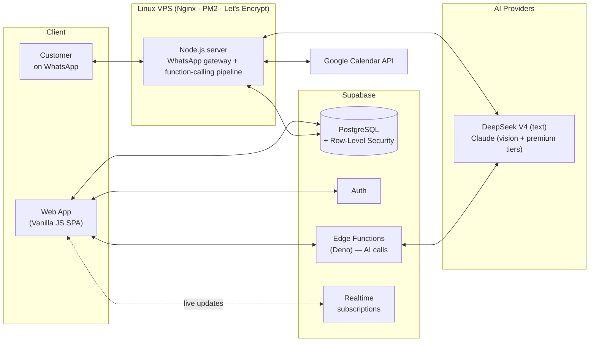

# PromptLab — Engineering Case Study

> **Live product:** [promptlab.pt](https://promptlab.pt) · free signup available for evaluation
>
> **Note:** PromptLab is a commercial product, so its source code is private. This repository documents the architecture, the engineering decisions and the hardest problems I solved building it — plus simplified, runnable code samples that illustrate the core mechanics.

## What is PromptLab?

PromptLab is an AI-powered business management platform for small and medium businesses. A business connects its WhatsApp number, defines its services, schedule and team — and an AI assistant handles customer conversations end-to-end: answering questions in the customer's language, checking real-time availability, and booking / rescheduling / cancelling appointments by **calling real backend tools**, not by guessing.

Built solo, from first line of code to production: database schema, backend, frontend, AI pipeline, integrations and server operations.

**Core capabilities:**

- 🤖 AI assistant on WhatsApp — books, reschedules and cancels through natural conversation, using **native function-calling** against a live backend
- 🗓️ Real-time scheduling engine — availability computed live from working hours, service durations and existing bookings
- 👥 Team distribution — multiple staff with individual schedules; bookings auto-assigned to the least-loaded qualified member
- 🌍 Multi-language — Portuguese, English, Spanish, Swedish and Armenian, detected automatically per conversation
- 📚 Knowledge base — each business feeds the assistant its own context (policies, FAQs, details)
- 🔗 Integrations — WhatsApp, two-way Google Calendar sync, transactional email (Resend)

## Architecture

**Stack at a glance**

| Layer | Technology | Why |
|---|---|---|
| Frontend | Vanilla JavaScript (ES6+), SPA with view router | Zero build step, full control, fast iteration as a solo dev |
| Backend | Node.js on a Linux VPS (PM2, Nginx) | A persistent process is required for the WhatsApp connection — serverless can't hold it |
| Database | Supabase (PostgreSQL, Auth, Edge Functions, Realtime) | Managed Postgres + auth + serverless functions in one, with RLS for multi-tenancy |
| AI | DeepSeek V4 (text) + Claude (vision & premium tiers), via native function-calling | Different models for different jobs — DeepSeek for conversation, Claude Sonnet for image understanding — with automatic fallback between them |
| Security | Row-Level Security on every table | Tenant isolation enforced at the database layer, not in application code |
| Ops | SSH/SCP deploys, PM2 process management, Certbot SSL | Simple, debuggable, appropriate for the scale |

## The hardest problems

### 1. An AI that proposes, a server that decides

The single most important design decision in the system. Letting an LLM be the last word on bookings is exactly how you get phantom appointments — confidently announced to a customer, never actually written, or written on top of someone else.

So the AI never touches the database. It runs as a **native function-calling loop**: the model is handed a set of typed tools and, instead of writing prose like *"ok, booked!"*, it emits a structured `tool_call`. The server executes that call against the real business logic, feeds the result back into the conversation, and only then lets the model speak. The conversation is the model's job; every guarantee is the server's.

The assistant has six tools:

| Tool | What it does |
|---|---|
| `check_availability` | Is this date/time free — and which staff are free? |
| `find_slots` | For a whole day, return how full it is plus the best free times |
| `book_appointment` | Create a confirmed appointment (only after the customer confirms) |
| `reschedule_appointment` | Move a date/time, or change the assigned professional |
| `cancel_appointment` | Cancel one of *this* customer's upcoming appointments |
| `list_client_appointments` | List this customer's upcoming appointments |

Three rules make this trustworthy:

- **The server re-validates at write time.** Even though the model already called `check_availability`, `book_appointment` re-runs an independent availability check *and* a duplicate-row check immediately before the `INSERT`. If the slot filled up two seconds ago — a concurrent booking — the write is rejected and the model apologises with the nearest alternative.
- **Identity comes from the connection, never the model.** The customer's phone and the business's user id are taken from the authenticated WhatsApp conversation. Any phone or user the model puts in its arguments is *ignored* — so a model can't be talked into reading or cancelling someone else's appointments.
- **The model can't lie about what it did.** A guard scans the model's reply for "done!" claims that weren't backed by an actual tool call, and nudges it to either call the tool or stop claiming — closing the gap between *saying* and *doing*.

The same loop runs against two provider formats — DeepSeek's `tool_calls` and Claude's `tool_use` blocks — through one executor over one set of real functions, so behaviour is identical no matter which model is serving.

A didactic, self-contained version of the loop is in [`examples/function-calling-pipeline.js`](examples/function-calling-pipeline.js).

> This pipeline replaced an earlier design where the AI emitted a hand-rolled `[WA_COMMAND]` text string that the server parsed with regexes. Moving to native function-calling deleted a whole class of parsing bugs and made the "server decides" boundary explicit in the type system.

### 2. A scheduling engine where every rule has exceptions

Computing *"what times are free on Tuesday?"* sounds trivial until real business rules arrive:

- Working hours differ per weekday, per business and per team member — resolved through a **2-level fallback**: a member's own hours, falling back to the establishment's hours when they have none. (The business owner isn't a separate level — they're simply the default first agenda, on establishment hours.)
- Service durations vary per service, on a fixed time grid; the **last bookable start time depends on the duration of the specific service** being requested.
- Buffer between appointments, when enabled, applies **only between confirmed bookings** — never against blocked time, the lunch break, or the opening/closing edges (a service may start or end flush against any of those). It's a configurable knob; production currently runs back-to-back on a 30-minute grid.
- In team mode a slot is "free" if *any* qualified member is free, and the booking **auto-assigns to the least-loaded** one — by that day's load, tie-broken by the week's. Eligibility is gated first: a member is only a candidate if they actually perform the requested service.

The engine computes availability in real time from these rules and exposes helpers like *nearest-slot suggestion* — when a customer asks for a taken time, the AI counter-offers the closest valid alternative instead of a dead "no".

A simplified version of the core algorithm — candidate generation, the buffer rule, and nearest-slot — is in [`examples/scheduling-engine-concept.js`](examples/scheduling-engine-concept.js).

### 3. One AI brain, many surfaces

The assistant runs on WhatsApp and on an in-app test simulator that must behave identically — same prompts, same tools, same rules. Early versions duplicated prompt logic per channel and they drifted apart constantly.

The fix was structural: **a single shared prompt module** is the only source of AI instructions — including the function-calling rules (*"to book, cancel or reschedule, use the tools only — never write a command in the text"*) — for every channel. The app's chat became a true simulator: if a flow works there, it works on WhatsApp, because it runs the same instructions against the same tools.

### 4. Multi-language without translation tables

Customers write in whatever language they want, and switch mid-conversation. The system detects the conversation language and the AI responds natively in **Portuguese, English, Spanish, Swedish or Armenian** — including correctly parsing dates and times expressed naturally (*"nästa fredag vid lunch"*, *"amanhã de manhã"*). Armenian brought a non-Latin script and its own date vocabulary through every layer — UI strings, the language detector, and the assistant itself.

Every intent pattern, server-side message and booking-flow rule is maintained across all five languages — a discipline problem as much as a technical one.

### 5. Production WhatsApp is unforgiving

A persistent WhatsApp connection that survives restarts, re-authentications and message-delivery quirks taught me more about production resilience than anything else: in-memory state that must be rebuilt, sessions that must be restored, and failure modes that only appear with real users on real phones. Deploys are scripted and the process is managed by PM2 with automatic recovery.

## Decisions I'd defend

- **Vanilla JS over React** — for a solo developer shipping fast: no framework churn, no build pipeline, no dependency treadmill. The SPA has its own lightweight view router and state handling, and it is enough.
- **A VPS over full serverless** — the WhatsApp gateway needs a long-lived process. Splitting the system into "persistent where required, serverless where convenient" (Edge Functions for AI calls) kept costs near zero and behaviour predictable.
- **Native function-calling over text commands** — making the AI request typed tools, instead of emitting a string the server parses, turned the AI/database boundary into something explicit and testable, and let the server stay the single source of truth.
- **RLS as the security model** — every table enforces tenant isolation at the database level. Application bugs cannot leak one business's data to another.
- **Boring deploys** — SCP + PM2 restart, ~5 seconds. CI/CD exists for the cases that need it, but the default path is the one I can reason about at 2 AM.

## What I'd do differently

- Introduce TypeScript earlier — the largest modules would have caught whole classes of bugs at edit time (and the tool schemas would type-check end to end).
- Automated test coverage for the scheduling engine from day one — its rule-exceptions are exactly where regressions hide.
- Structured logging from the start, instead of retrofitting it when debugging production conversations.

## About me

I'm Leif Lima. Five-plus years in multilingual customer operations for global SaaS platforms; since November 2025, a self-taught developer. PromptLab is my first production system — designed, built, deployed and operated end-to-end.

- 🌐 [promptlab.pt](https://promptlab.pt)
- 💼 [linkedin.com/in/leiflima](https://www.linkedin.com/in/leiflima)
- 📧 leiflima@icloud.com
