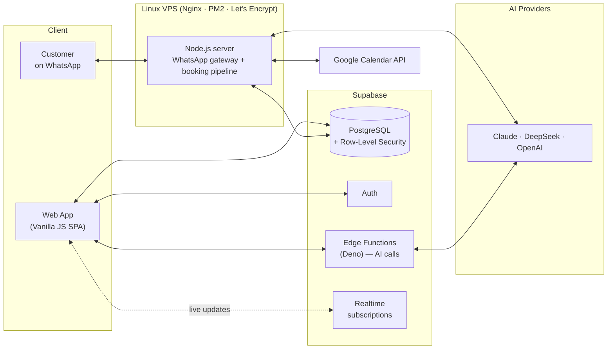

# PromptLab — Engineering Case Study

> **Live product:** [promptlab.pt](https://promptlab.pt) · free signup available for evaluation
>
> **Note:** PromptLab is a commercial product, so its source code is private. This repository documents the architecture, the engineering decisions and the hardest problems I solved building it — plus simplified code samples that illustrate the core concepts.

## What is PromptLab?

PromptLab is an AI-powered business management platform for small and medium businesses. A business connects its WhatsApp number, defines its services, schedule and team — and an AI assistant handles customer conversations end-to-end: answering questions in the customer's language, checking real-time availability, booking / rescheduling / cancelling appointments, and distributing work across team members.

Built solo, from first line of code to production: database schema, backend, frontend, AI pipeline, integrations and server operations.

**Core capabilities:**

- 🤖 AI assistant on WhatsApp — books, reschedules and cancels appointments through natural conversation
- 🗓️ Real-time scheduling engine — availability computed live from working hours, service durations, buffers and existing bookings
- 👥 Team distribution — multiple staff members with individual schedules; bookings auto-assigned by load
- 🌍 Multi-language — Portuguese, English, Spanish and Swedish, detected automatically per conversation
- 📚 Knowledge base — each business feeds the assistant its own context (policies, FAQs, details)
- 🔗 Integrations — WhatsApp, Google Calendar sync, Stripe subscriptions, transactional email

## Architecture

**Stack at a glance**

| Layer | Technology | Why |
|---|---|---|
| Frontend | Vanilla JavaScript (ES6+), SPA with view router | Zero build step, full control, fast iteration as a solo dev |
| Backend | Node.js on a Linux VPS (PM2, Nginx) | A persistent process is required for the WhatsApp connection — serverless can't hold it |
| Database | Supabase (PostgreSQL, Auth, Edge Functions, Realtime) | Managed Postgres + auth + serverless functions in one, with RLS for multi-tenancy |
| AI | Claude, DeepSeek, OpenAI APIs | Different models for different jobs; graceful fallback between providers |
| Security | Row-Level Security on every table | Tenant isolation enforced at the database layer, not in application code |
| Ops | SSH/SCP deploys, PM2 process management, Certbot SSL | Simple, debuggable, appropriate for the scale |

## The hardest problems

### 1. An AI that proposes, a server that decides

The single most important design decision in the system. Early on it became clear that letting an LLM be the last word on bookings is how you get phantom appointments.

So the AI never writes to the database. It fills a structured command — intent, date, time, service, client — and emits it in a machine-readable format. The server then **re-validates everything at write time**: does the slot still exist? is it inside working hours? does it collide with another booking made two seconds ago? Only then does the appointment exist.

The AI brings the conversation; deterministic code brings the guarantees. When validation fails, the AI simply apologises and offers the nearest valid slot.

### 2. A scheduling engine where every rule has exceptions

Computing "what times are free on Tuesday?" sounds trivial until real business rules arrive:

- Working hours differ per weekday, per business, and per team member (3-level fallback: member → owner → establishment)
- Service durations vary per service — or are fixed per business, configurable
- Buffer time between appointments applies **only between confirmed bookings** — not against blocked time, not against opening/closing hours (a service may end exactly when a block starts)
- Last bookable start time depends on the duration of the specific service being requested
- Team mode: a slot is "free" if *any* qualified team member is free, and the booking auto-assigns to the least-loaded one

The engine computes availability in real time from these rules, and exposes helpers like *nearest-slot suggestion* — when a customer asks for a taken time, the AI counter-offers the closest valid alternative instead of a dead "no".

A simplified, didactic version of the core algorithm is in [`examples/scheduling-engine-concept.js`](examples/scheduling-engine-concept.js).

### 3. One AI brain, many surfaces

The assistant runs on WhatsApp and on an in-app test simulator that must behave identically — same prompts, same rules, same output contract. Early versions duplicated prompt logic per channel and they drifted apart constantly.

The fix was structural: **a single shared prompt module** is the only source of AI instructions for every channel. The app's chat became a true simulator — if a flow works there, it works on WhatsApp, because it literally runs the same instructions.

### 4. Multi-language without translation tables

Customers write in whatever language they want, and switch mid-conversation. The system detects the conversation language and the AI responds natively in Portuguese, English, Spanish or Swedish — including correctly parsing dates and times expressed naturally ("nästa fredag vid lunch", "amanhã de manhã").

Every intent-detection pattern, server-side message and booking-flow rule is maintained across all four languages — a discipline issue as much as a technical one.

### 5. Production WhatsApp is unforgiving

A persistent WhatsApp connection that survives restarts, re-authentications and message-delivery quirks taught me more about production resilience than anything else: in-memory state that must be rebuilt, sessions that must be restored, and failure modes that only appear with real users on real phones. Deploys are scripted and the process is managed by PM2 with automatic recovery.

## Decisions I'd defend

- **Vanilla JS over React** — for a solo developer shipping fast, no framework churn, no build pipeline, no dependency treadmill. The SPA has its own lightweight view router and state handling, and it is enough.
- **A VPS over full serverless** — the WhatsApp gateway needs a long-lived process. Splitting the system into "persistent where required, serverless where convenient" (Edge Functions for AI calls) kept costs near zero and behaviour predictable.
- **RLS as the security model** — every table enforces tenant isolation at the database level. Application bugs cannot leak one business's data to another.
- **Boring deploys** — SCP + PM2 restart, ~5 seconds. CI/CD exists for the cases that need it, but the default path is the one I can reason about at 2 AM.

## What I'd do differently

- Introduce TypeScript earlier — the largest modules would have caught whole classes of bugs at edit time
- Automated test coverage for the scheduling engine from day one (its rule-exceptions are exactly where regressions hide)
- Structured logging from the start, instead of retrofitting it when debugging production conversations

## About me

I'm Leif Lima. Five-plus years in multilingual customer operations for global SaaS platforms; since November 2025, a self-taught developer. PromptLab is my first production system — designed, built, deployed and operated end-to-end.

- 🌐 [promptlab.pt](https://promptlab.pt)
- 💼 [linkedin.com/in/leiflima](https://www.linkedin.com/in/leiflima)
- 📧 leiflima@icloud.com
