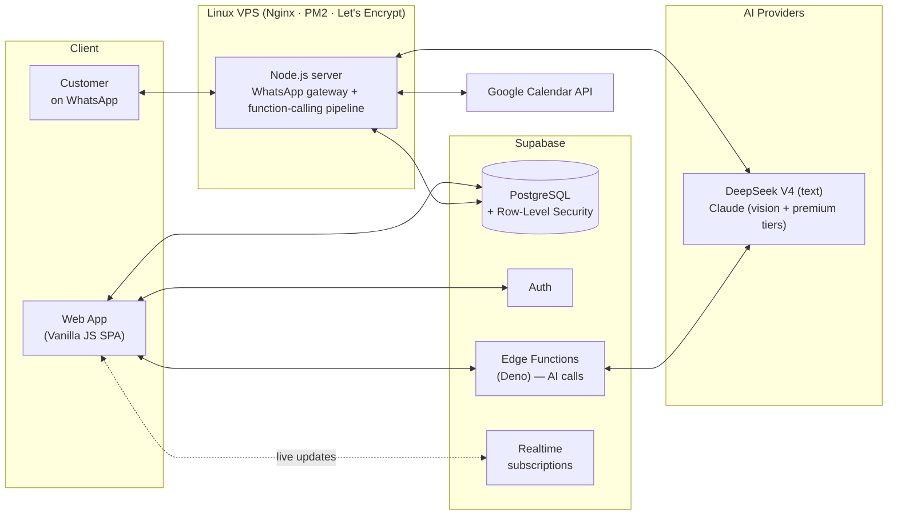

# PromptLab — Engineering Case Study

**[Live product → promptlab.pt](https://promptlab.pt)** · built solo · in production 24/7 · free signup for evaluation

> **TL;DR** — I designed, built and operate an AI-powered booking platform where an assistant handles real customer conversations on WhatsApp end-to-end: it answers in the customer's own language, checks live availability, and books, reschedules and cancels appointments by **calling real backend tools — never by guessing**.
>
> PromptLab is a commercial product, so its source code is private. This repository documents the architecture, the hardest problems and the engineering decisions — with simplified, runnable samples in [`examples/`](examples/).

---

## The product in one conversation

```text
Customer   Hi! Do you have anything tomorrow afternoon?
Assistant  Tomorrow I have 14:30, 15:00 and 16:30 free. Which works for you?
Customer   16:30. Actually — can it be Thursday instead, same time?
Assistant  Thursday at 16:30 works. Shall I book it?
Customer   Yes
Assistant  Done — Thursday at 16:30 with Ana. See you then! 📅
```

*Illustrative exchange. Behind it: `find_slots` → `check_availability` → `book_appointment` — every step executed and validated **server-side**, in real time, against a live database. The conversation is the model's job; every guarantee is the server's.*

---

## Contents

1. [What is PromptLab?](#what-is-promptlab)
2. [Architecture](#architecture)
3. [The five hardest problems](#the-five-hardest-problems)
4. [Decisions I'd defend](#decisions-id-defend)
5. [What I'd do differently](#what-id-do-differently)
6. [About me](#about-me)

---

## What is PromptLab?

An AI-powered business management platform for small and medium businesses. A business connects its WhatsApp number, defines its services, schedule and team — and an AI assistant takes over customer conversations.

Built solo, from first line of code to production: database schema, backend, frontend, AI pipeline, integrations and server operations.

| | Capability |
|---|---|
| 🤖 | **AI assistant on WhatsApp** — books, reschedules and cancels through natural conversation, using **native function-calling** against a live backend |
| 🗓️ | **Real-time scheduling engine** — availability computed live from working hours, service durations and existing bookings |
| 👥 | **Team distribution** — multiple staff with individual schedules; bookings auto-assigned to the least-loaded member |
| 🌍 | **Multi-language** — the assistant replies natively in the customer's language (UI localised in five) |
| 📚 | **Knowledge base** — each business feeds the assistant its own context: policies, FAQs, details |
| 🔗 | **Integrations** — WhatsApp, two-way Google Calendar sync, transactional email |

---

## Architecture



### Stack at a glance

| Layer | Technology | Why |
|---|---|---|
| Frontend | Vanilla JavaScript (ES6+), SPA with view router | Zero build step, full control, fast solo iteration |
| Backend | Node.js on a Linux VPS (PM2, Nginx) | WhatsApp needs a persistent process — serverless can't hold it |
| Database | Supabase (PostgreSQL, Auth, Edge Functions, Realtime) | Managed Postgres + auth + serverless in one, RLS for multi-tenancy |
| AI | DeepSeek V4 (text) + Claude (vision & premium), native function-calling | Different models for different jobs |
| Security | Row-Level Security on every table | Tenant isolation enforced by the database, not by app code |
| Ops | SSH/SCP deploys, PM2, Certbot SSL | Simple, debuggable, right for the scale |

---

## The five hardest problems

### 1 · An AI that proposes, a server that decides

The most important design decision in the system. Letting an LLM be the last word on bookings is exactly how you get phantom appointments — confidently announced to a customer, never actually written, or written on top of someone else's.

**So the AI never touches the database.** It runs as a native function-calling loop: the model is handed a set of typed tools and, instead of writing prose like *"ok, booked!"*, it emits a structured `tool_call`. The server executes it against the real business logic, feeds the result back, and only then lets the model speak.

The assistant has six tools:

| Tool | What it does |
|---|---|
| `check_availability` | Is this date/time free — and which staff are free? |
| `find_slots` | For a whole day: how full it is, plus the best free times |
| `book_appointment` | Create a confirmed appointment (only after the customer confirms) |
| `reschedule_appointment` | Move a date/time, or change the assigned professional |
| `cancel_appointment` | Cancel one of *this* customer's upcoming appointments |
| `list_client_appointments` | List this customer's upcoming appointments |

Three rules make it trustworthy:

1. **The server re-validates at write time.** Even after the model called `check_availability`, `book_appointment` re-runs an independent availability check *and* a duplicate check immediately before the `INSERT`. If the slot filled up two seconds ago, the write is rejected — and the model apologises with the nearest alternative.
2. **Identity comes from the connection, never the model.** The customer's phone and the business's id are taken from the authenticated WhatsApp conversation. Whatever the model puts in its arguments is *ignored* — so it can't be talked into touching someone else's appointments.
3. **The model can't lie about what it did.** A guard scans the reply for "done!" claims with no tool call behind them, and forces the model to either call the tool or stop claiming. It closes the gap between *saying* and *doing*.

The same loop runs against two provider formats — DeepSeek's `tool_calls` and Claude's `tool_use` blocks — through one executor over one set of real functions, so behaviour is identical regardless of which model is serving.

▶ Didactic, self-contained version: [`examples/function-calling-pipeline.js`](examples/function-calling-pipeline.js)

> This pipeline replaced an earlier design where the AI emitted a hand-rolled `[WA_COMMAND]` text string parsed with regexes. Moving to native function-calling deleted a whole class of parsing bugs and made the "server decides" boundary explicit.

### 2 · A scheduling engine where every rule has exceptions

*"What times are free on Tuesday?"* sounds trivial — until real business rules arrive:

- **Working hours differ** per weekday, per business and per team member — resolved through a 2-level fallback: a member's own hours, falling back to the establishment's. (The owner isn't a special level — just the default first agenda.)
- **Durations vary per service**, so the last bookable start time depends on which service is being requested.
- **Bookings sit back-to-back** on a fixed 30-minute grid. Blocked time, lunch and per-day exceptions carve out the day — and a service may start or end *flush* against any of those edges.
- **In team mode**, a slot is "free" if *any* member is free, and the booking auto-assigns to the least-loaded one — by that day's load, tie-broken by the week's.

The engine computes availability in real time and exposes helpers like **nearest-slot suggestion** — when a customer asks for a taken time, the AI counter-offers the closest valid alternative instead of a dead "no".

▶ Simplified core algorithm: [`examples/scheduling-engine-concept.js`](examples/scheduling-engine-concept.js)

### 3 · One AI brain, many surfaces

The assistant runs on WhatsApp and on an in-app simulator that must behave identically. Early versions duplicated prompt logic per channel — and they drifted apart constantly.

The fix was structural: **a single shared prompt module** is the only source of AI instructions, for every channel. If a flow works in the simulator, it works on WhatsApp, because it runs the same instructions against the same tools.

### 4 · Multi-language without translation tables

Customers write in whatever language they want — and switch mid-conversation. The assistant replies natively in the customer's language, including parsing dates and times expressed naturally (*"nästa fredag vid lunch"*, *"amanhã de manhã"*).

The UI, server-side messages and booking-flow rules are maintained across five languages (Portuguese, English, Spanish, Swedish, Armenian — a non-Latin script through every layer). A discipline problem as much as a technical one.

### 5 · Production WhatsApp is unforgiving

A persistent WhatsApp connection that survives restarts, re-authentications and delivery quirks taught me more about production resilience than anything else: in-memory state that must be rebuilt, sessions that must be restored, and failure modes that only appear with real users on real phones. Deploys are scripted; the process is managed by PM2 with automatic recovery.

---

## Decisions I'd defend

- **Vanilla JS over React** — for a solo developer shipping fast: no framework churn, no build pipeline, no dependency treadmill. A lightweight view router and state handling are enough.
- **A VPS over full serverless** — the WhatsApp gateway needs a long-lived process. "Persistent where required, serverless where convenient" kept costs near zero and behaviour predictable.
- **Native function-calling over text commands** — typed tools made the AI/database boundary explicit and testable, with the server as the single source of truth.
- **RLS as the security model** — tenant isolation enforced by the database itself. Application bugs cannot leak one business's data to another.
- **Boring deploys** — SCP + PM2 restart, ~5 seconds. The default path is the one I can reason about at 2 AM.

## What I'd do differently

- **TypeScript earlier** — the largest modules would have caught whole classes of bugs at edit time, and the tool schemas would type-check end to end.
- **Automated tests for the scheduling engine from day one** — its rule-exceptions are exactly where regressions hide.
- **Structured logging from the start**, instead of retrofitting it while debugging production conversations.

---

## About me

I'm **Leif Lima**. Five-plus years in multilingual customer operations for global SaaS platforms; since November 2025, a self-taught developer. PromptLab is my first production system — designed, built, deployed and operated end-to-end.

🌐 [promptlab.pt](https://promptlab.pt) · 💼 [linkedin.com/in/leiflima](https://www.linkedin.com/in/leiflima) · 📧 leiflima@icloud.com
